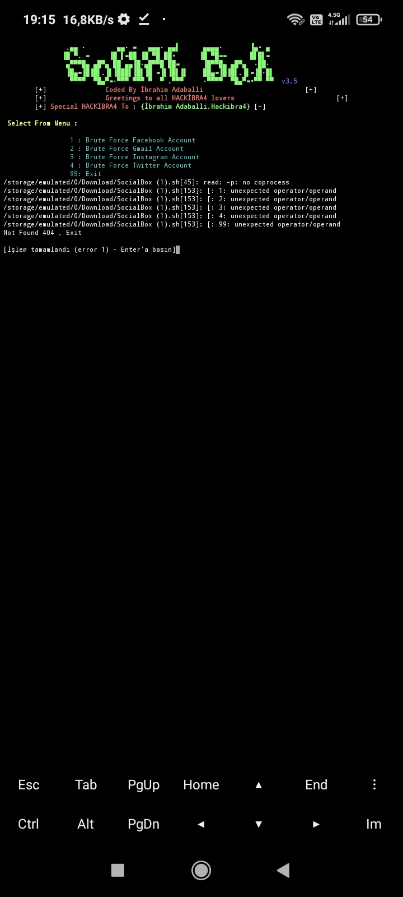

# SocialBox
<a href='https://codespaces.new/ibrahimadaballi/SocialBox'></a>
SocialBox is a Bruteforce Attack Framework [ Facebook , Gmail , Instagram ,Twitter ] , Coded By Belahsan Ouerghi
# Installation
```
apt-get update
apt-get install git
git clone https://github.com/ibrahimadaballi/SocialBox.git 
cd SocialBox
chmod +x install-sb.sh
./install-sb.sh
```
# Run
```
./SocialBox.sh
```
# Screenshots :

# Tested On :
* Backbox linux
* Ubuntu 
* Kali linux
# Contact
* [Contact]: İbrahim Adaballi 
# Authors :
* Tiktok     : adaballi_ibrahim2147
* instagram :ibrahim_adaballi_21
* Twitter   : adaballi_ibrahim
* SocialBox : İbrahim Adaballi 
